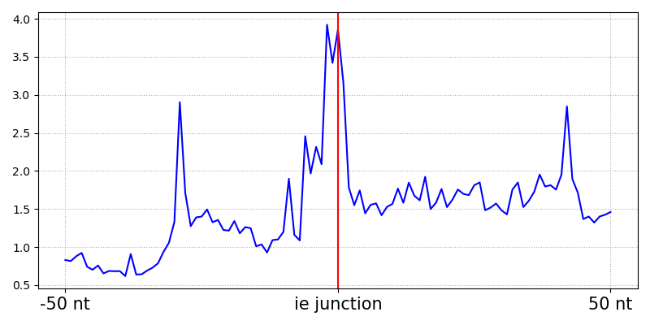
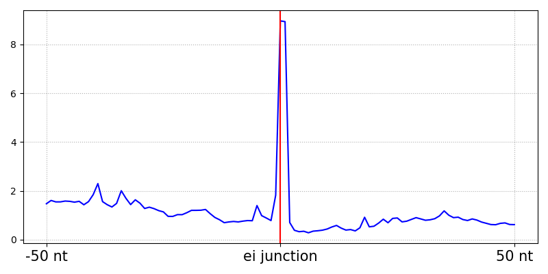

# Bioinfo1 My Own Analysis

## My Own Analysis 1. Research plan
Plant immunity suppressor AtSKRP는 RNA-binding protein으로 unspliced RNA의 exon 3'-end을 타겟한다고 알려졌다
본 분석에서는 AtSKRP의 eCLIP-seq data를 활용해서 AtSKRP가 binding하는 위치를 unspliced RNA에서 시각화한다.
나아가 AtSKRP가 결합하는 RNA의 motif를 분석한다.

## My Own Analysis 2. Analysis
중국 ncbi에서 논문에서 사용한 raw sequencing data를 다운 받았다. 시퀀싱은 paired end sequencing으로 illumina를 사용하였다. fastp를 통해 먼저 raw read를 adaptor trimming 등 전처리를 진행하였다. 그후 Arabidopsis TAIR9 genome에 hisat2를 활용해서 mapping하였다. 이를 이용해서 read의 5'-end가 위치한 position에서 coverage를 계산했다.
Exon sequence는 Arabidopsis TAIR9 gene annotation을 활용했다. 이 때, exon과 exon 주위의 영역까지 포함해서 read peak를 찾기 위해서 bedtools의 slop를 사용해서 exon 영역을 5'과 3' 쪽으로 50 bp 만큼 확장하였다. 그 후 read coverage bed와 bedtools intersact를 활용하여 합쳤다.
시각화는 python을 활용하였으며 exon의경계부분을 0으로 잡고 상대적인 위치를 계산하였다. 결과는 아래 그림과 같다.

전체 데이터 분석 과정은 scripts/my_own_analysis.ipynb에 있다.

## Reference
Chen L, Xu Z, Huang J, et al. Plant immunity suppressor SKRP encodes a novel RNA-binding protein that targets exon 3' end of unspliced RNA. New Phytol. 2023;240(4):1467-1483. doi:10.1111/nph.19236

